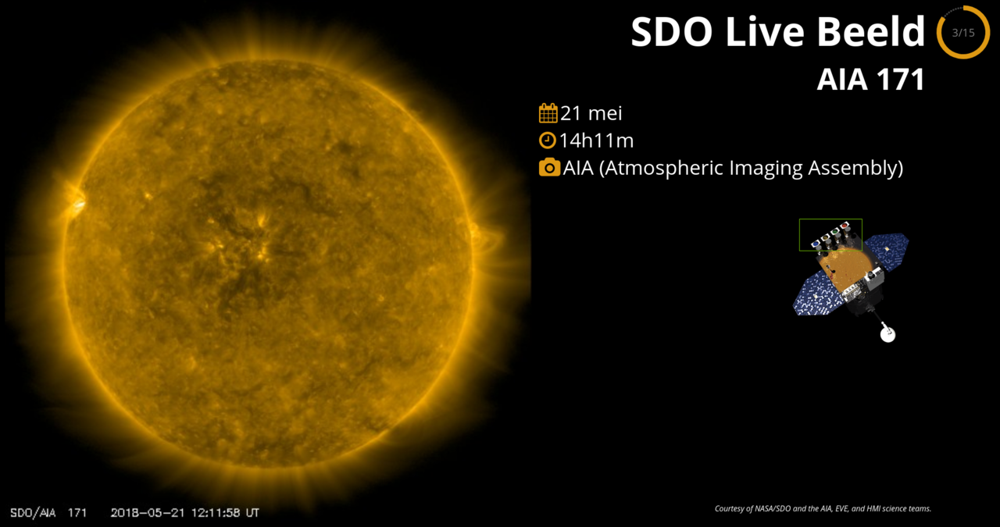

SDO_Live
========

Kiosk application which periodically retrieves images taken by the SDO (Solar
Dynamics Observatory) spacecraft. The images are displayed in a carousel,
accompanied by the timestamp and sensor name.

Settings can be changed by editing [app/channels.js](app/channels.js) and [static/js/views.js](static/js/views.js).

Starting full screen
--------------------

The script will attempt to request full screen mode from the browser. This normally fails because the action is not initiated by the user.

In Firefox you can change a config parameter to disable this restriction.
Type `about:config` in the URL bar. Change the value of `full-screen-api.allow-trusted-requests-only` from `true` to `false`.

